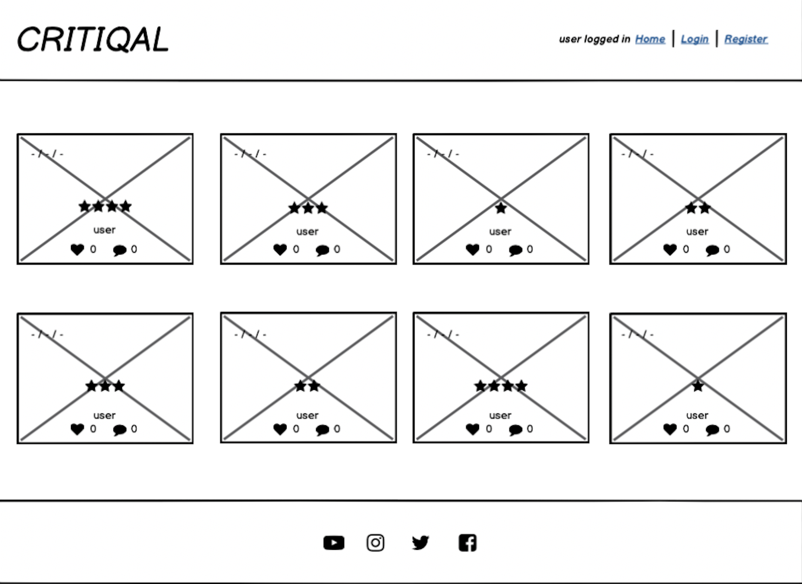
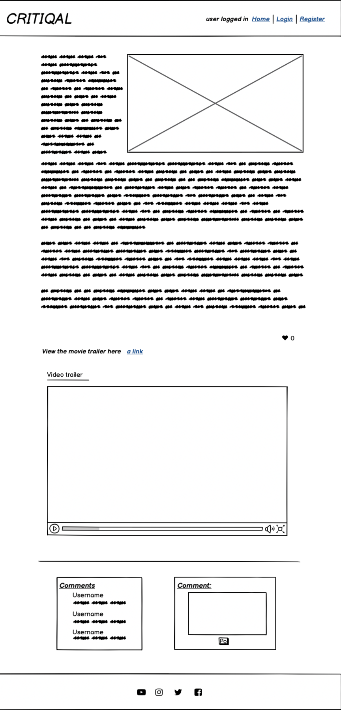
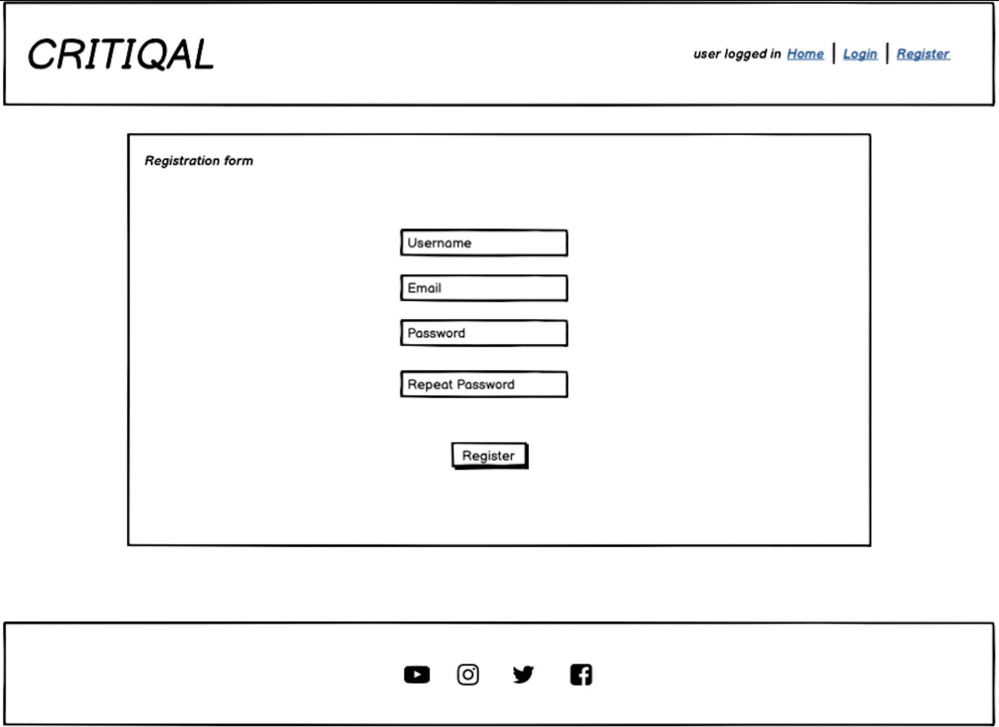
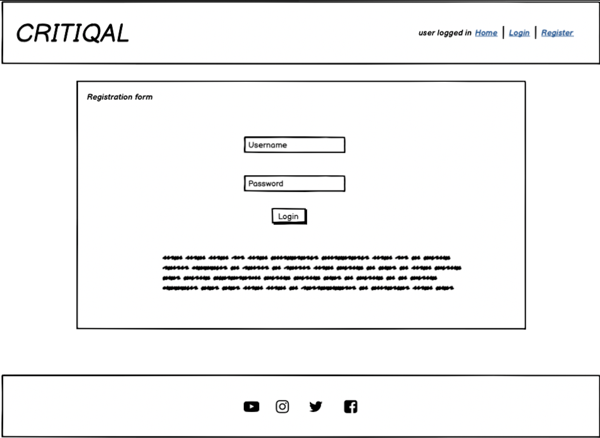
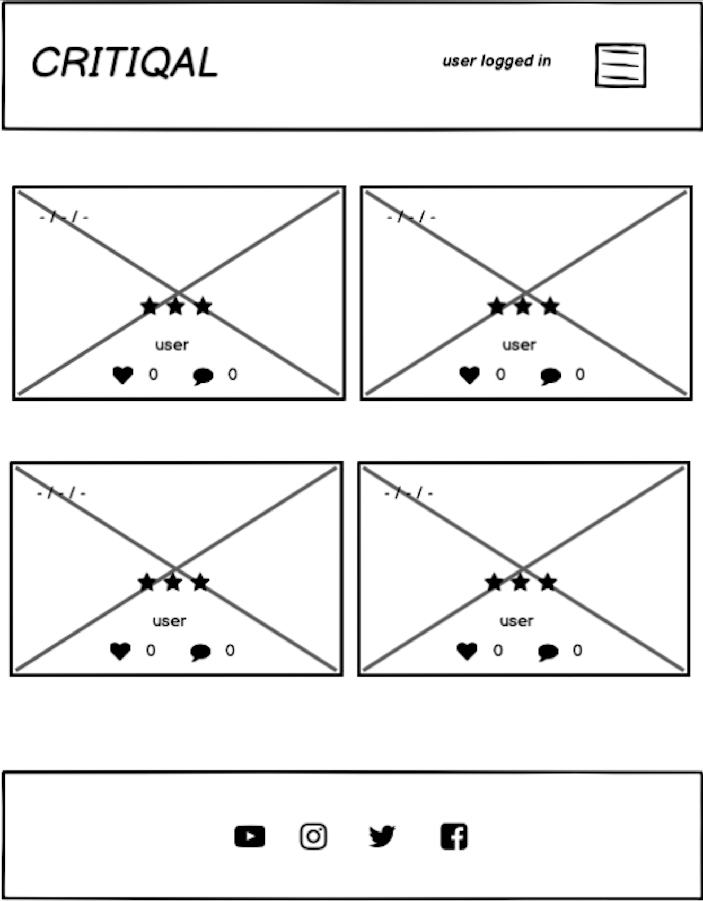
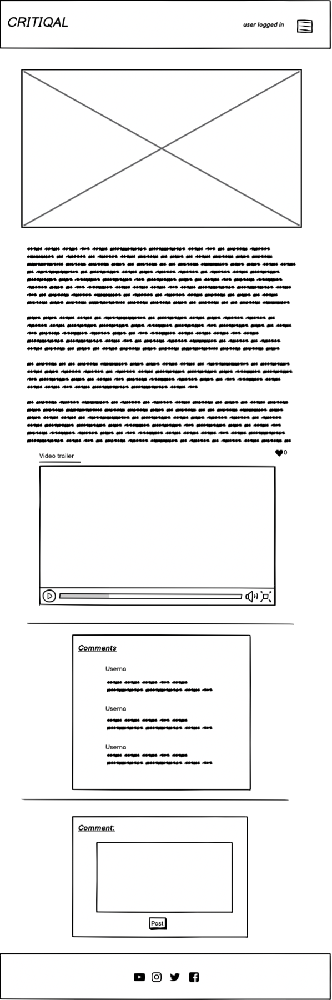
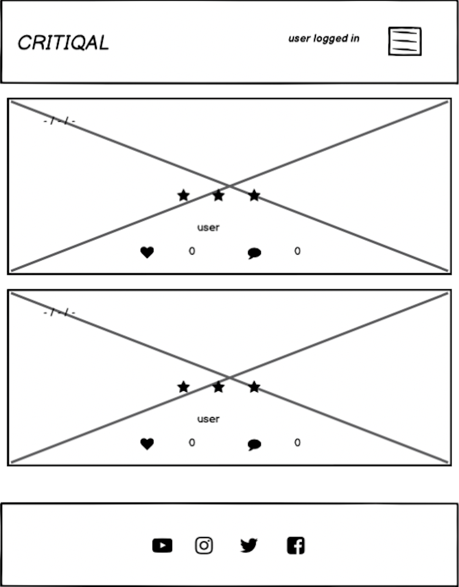

# Critiqal

Critiqal is review site for the coolest movies of all time, whether they are old classics or hot new blockbusters. This site offers users the opportunity to sign up, read reviews, and discuss their thoughts in the comments section. The reviews are organised into cards showing only the most crucial information about the movies. Users can chose to read more information about the reviews for better insite.

# UX

## Visitor Goal

* Allow users to browse reviews about movies.
* Enable users to register to the review site.
* Allow the users to like reviews.
* Allow the user to engage in discussions in the comments section.
* Enable users to read a reviews to gain information about a movie.
* Allow users to watch a movie trailer to understand the plot.

### User Stories

### User

* As a **site User** I can **view a review list** so that **I can select a review to read**.
* As a **site User** I can **view a paginated list of reviews** so that **I can easily select one to view**.
* As a **site User** I can **Register and account** so that **comment and like a review**.
* As a **site User** I can **comment on review posts** so that **I can share my opinion and engage in discussion**.
* As a **site User** I can **like/unlike a review** so that **I can show whether I agree with it**.
* As a **site User** I can **view a trailer from the review post** so that **I can know what the movie is about and whether I like it**.
* As a **site User** I can **click a button** so that **I can view full content on a review**.
* As a **site User** I can **View the likes on a review** so that **I can see whether audience is in agreement**.
* As a **site User** I can **view the comments on a post** so that **I can read the discussion**.
* As a **site User** I can **view a star rating** so that **I can know quickly how good a movie is**.

### Admin

* As a **Site admin** I can **upload a youtube link to a trailer** so that **audience can view trailer directly from the review**.
* As a **Site admin** I can **create, read, update and delete reviews** so that **I can manage content**.
* As a **Site admin** I can **approve the comments on a review** so that **I can ensure comments are unobjectionable**.
* As a **site admin** I can **create drafts** so that **submit a review at a later time**.
* As a **site admin** I can **View the likes on a review** so that **I can see whether audience is in agreement**.
* As a **site admin** I can **view the comments on a post** so that **read the discussion**.

### Developer

* As a **developer** I want to **ensure that the user can't break the flow of the site** by **applying defensive design choices**.
* As a **developer** I want to **enable the authenticated user to access all features of the site correctly**.
* As a **developer** I want to **provide options for the admin to quickly modify site**.

### Design Features

#### Fonts:

For the logo of Critical I wanted a font that was sharp, to emphasise the idea that created the name. 
To be critical and to critique. Hence, I chose a font that was narrow to embody this idea. 
The Font I chose for this is [League Gothic](https://fonts.google.com/specimen/League+Gothic?query=league+gothic) font.
This font is the main font for this site.

The second font I used was [Roboto](https://fonts.google.com/specimen/Roboto?query=roboto), which is a very simple font that compliments the League Gothic font well.

#### Colours:

The main colour I used for this site is #C1EBFC, which is a light blue colour. I thought it was an very striking colour which allowed the logo to stand out. 
To compliment this I chose a few different tones of grey, which further allowed the light blue to stand out whereit was applied.

### Wireframes

#### Home Page Desktop

#### Review Content Page Desktop

#### Registration Form Desktop

#### Login Form Desktop

#### Home Page Tablet 

#### Review Content Page Tablet

#### Home page Mobile

