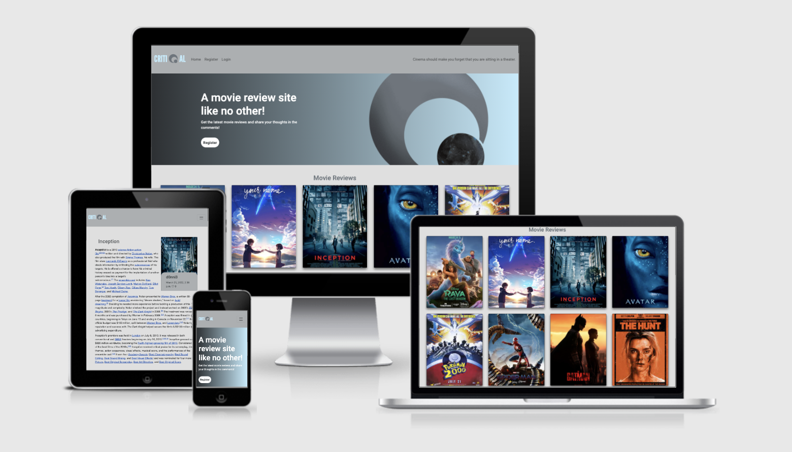
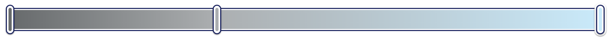
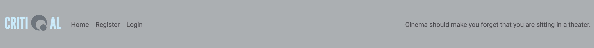
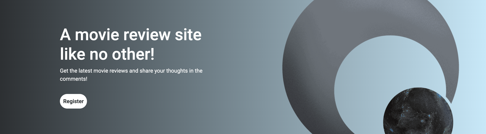
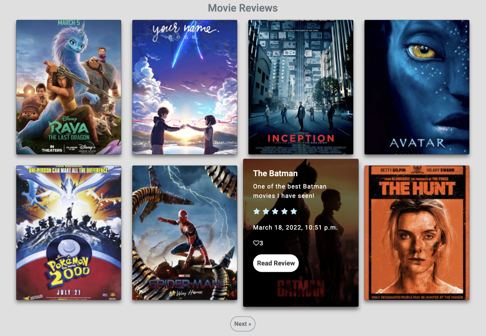
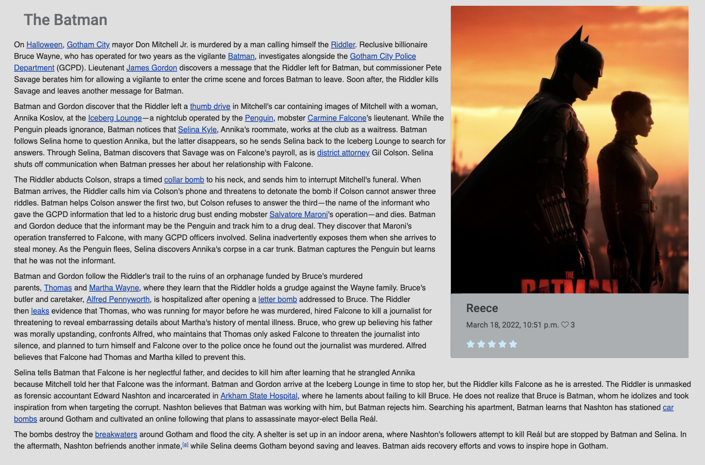
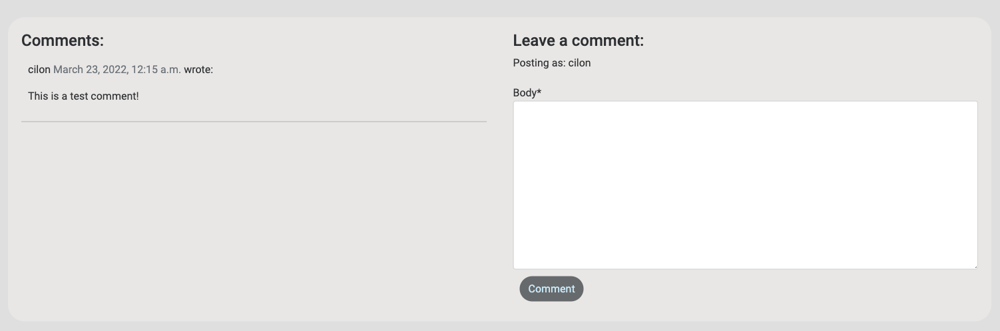
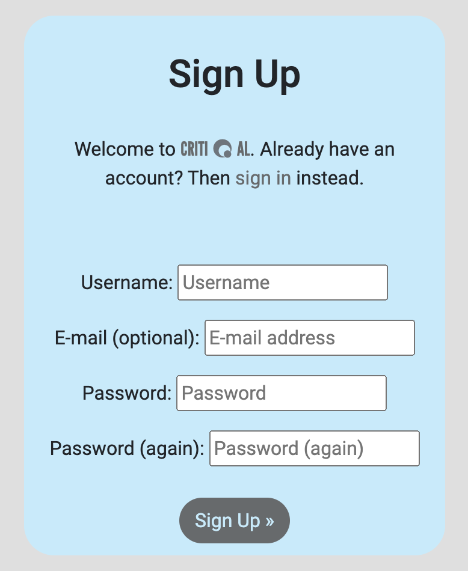

# Critiqal

Critiqal is review site for the coolest movies of all time, whether they are old classics or hot new blockbusters. This site offers users the opportunity to sign up, read reviews, and discuss their thoughts in the comments section. The reviews are organised into cards showing only the most crucial information about the movies. Users can chose to read more information about the reviews for better insite.

# UX

## Visitor Goal

* Allow users to browse reviews about movies.
* Enable users to register to the review site.
* Allow the users to like reviews.
* Allow the user to engage in discussions in the comments section.
* Enable users to read a reviews to gain information about a movie.
* Allow users to watch a movie trailer to understand the plot.

### User Stories

### User

* As a **site User** I can **view a review list** so that **I can select a review to read**.
* As a **site User** I can **view a paginated list of reviews** so that **I can easily select one to view**.
* As a **site User** I can **Register and account** so that **comment and like a review**.
* As a **site User** I can **comment on review posts** so that **I can share my opinion and engage in discussion**.
* As a **site User** I can **like/unlike a review** so that **I can show whether I agree with it**.
* As a **site User** I can **view a trailer from the review post** so that **I can know what the movie is about and whether I like it**.
* As a **site User** I can **click a button** so that **I can view full content on a review**.
* As a **site User** I can **View the likes on a review** so that **I can see whether audience is in agreement**.
* As a **site User** I can **view the comments on a post** so that **I can read the discussion**.
* As a **site User** I can **view a star rating** so that **I can know quickly how good a movie is**.

### Admin

* As a **Site admin** I can **upload a youtube link to a trailer** so that **audience can view trailer directly from the review**.
* As a **Site admin** I can **create, read, update and delete reviews** so that **I can manage content**.
* As a **Site admin** I can **approve the comments on a review** so that **I can ensure comments are unobjectionable**.
* As a **site admin** I can **create drafts** so that **submit a review at a later time**.
* As a **site admin** I can **View the likes on a review** so that **I can see whether audience is in agreement**.
* As a **site admin** I can **view the comments on a post** so that **read the discussion**.

### Developer

* As a **developer** I want to **ensure that the user can't break the flow of the site** by **applying defensive design choices**.
* As a **developer** I want to **enable the authenticated user to access all features of the site correctly**.
* As a **developer** I want to **provide options for the admin to quickly modify site**.

### Design Features

#### Fonts:

For the logo of Critical I wanted a font that was sharp, to emphasise the idea that created the name. 
To be critical and to critique. Hence, I chose a font that was narrow to embody this idea. 
The Font I chose for this is [League Gothic](https://fonts.google.com/specimen/League+Gothic?query=league+gothic) font.
This font is the main font for this site.

The second font I used was [Roboto](https://fonts.google.com/specimen/Roboto?query=roboto), which is a very simple font that compliments the League Gothic font well.

#### Colours:

The main colour I used for this site is #C1EBFC, which is a light blue colour. I thought it was an very striking colour which allowed the logo to stand out. 
To compliment this I chose a few different tones of grey, which further allowed the light blue to stand out whereit was applied.

### Wireframes

Some pages are not shown to be on different screen sizes. This is because the page is the same for smaller screen sizes but for narrower screens.

#### Desktop:

The home page has been slightly adapted to include a main image since the wireframing was decided. But all other features remained the same.

- [Desktop view of Home page](https://github.com/reececilon/critiqal-p4/blob/main/static/media/dthome.png)
- [Desktop view of Review content page](https://github.com/reececilon/critiqal-p4/blob/main/static/media/dtreview.png)
- [Desktop view of Registration page](https://github.com/reececilon/critiqal-p4/blob/main/static/media/dtregister.png)
- [Desktop view of Login page](https://github.com/reececilon/critiqal-p4/blob/main/static/media/dtlogin.png)

#### Tablet:

- [Tablet view of Home page](https://github.com/reececilon/critiqal-p4/blob/main/static/media/thome.png)
- [Tablet view of Review content page](https://github.com/reececilon/critiqal-p4/blob/main/static/media/treview.png)

#### Home page Mobile:

- [Mobile view of Home page](https://github.com/reececilon/critiqal-p4/blob/main/static/media/mhome.png)

## Features

### Existing Features

* Header
    * The header starts at the beginning of the page which includes the site logo, **Critiqal**, which acts as a link to the Home page.
    * Navigation is also present in the header, allowing the user to Register, Login/Logout, or return to the home page.
    * The logo is displayed in the main colour of the site, light blue, against the grey background.
    * And finally a quote about cinema.

* Main Image
    * The main image section changes depending on whether the user is authenticated. If the user is not authenticated, The main section displays a registration button followed by the site logo.
    * I the user is Authenticated, the mainsection describes the purpose of the site.
    * The registration button changes colour when hovered over to indicate to the user that it is clickable.

* Review List 
    * The movie reviews are paginated to hold only 8 reviews per page.
    * Each review is desplayed on a card which has an overlay providing only the most essential information about the movie review.
    * When Hovered over, the overlay of the cards is displayed, showing: the movie name, the rating, the excerpt, the author, the created-on date, and the no. of likes.
    * A clickable button is also displayed enabling the user to **Read** the review. And to further encourage this to the user, the button is designed to turn light-blue when hovered over.
    * A **Next** button is also featured on the section to enable the user to view more reviews.

* Footer
    * The footer uses the same styling as the rest of the site. Containing the sicial links of the site, to enable the user to keep updated with the reviews through social media.
    * The links show an icon for each social in a dark grey colour.
    * When hovered over Each link will turn light blue.

* Review Content 
    * This section displays the main information of the review. With text about the movie that wraps around the main image card.
    * The image card shows the rating of the movie when hovered over, the auther, the created-on date, and a heart icon followed by the no. of likes.
    * The heart icon signifies likes of the reviews.
    * The heart icon is clickable, and will like or unlike of the uses clicks.
    * The icon is only clickable in the review content section to encourage the user to read the content before deciding whether they like the movie.
    * If a Youtube link for the movie is provided, the review will automatically show an iframe, enabling the user to watch the movie trailer directly from this site.
    * If a link is not provided, the site will tell the user that no trailer is available.

* Comments Section
    * The comments section shows past comments on the left side of the screen with each comment in descending order, based on created date. Where older comments are displayed at the top. Allowing conversation to flow better.
    * If the user is authenticated, a comment box will be displayed on the right, allowing the user to comment on the review.
    * A button in a dark grey colour turns light-blue, following the colour theme of the site, when the user hovers over, to allow the user to post the comment for approval by the admin of the site.

* Registration Form
    * The registration form is displayed in the main colour theme of the site.
    * The user is requred to choose a username and password to sign up.
    * Email is an optionaly field.
    * A link to the login page is also available to users already signed up.
    * The login page is similar in aesthetic to the sign-up page.

## Data Storage

### User Table

| Title            | Key In Database | Form Validation | Data Type |
|------------------|-----------------|-----------------|-----------|
| Account id       | _id             | No Validation   | Primary Key  |
| Username       | username      | max length 150 | CharField |
| Email Address       | email       | must contain @ and .com etc | Email |

### Review Table

| Title            | Key In Database | Form Validation | Data Type |
|------------------|-----------------|-----------------|-----------|
| Author       |      author        |  no validation  | ForeignKey  |
| Title       |   title   | max length 200 | CharField |
| image       |  featured_image   | no form validation | CloudinaryImage |
| content      |  content | no max length | TextField |
| created      | created_date | datetime.date.today | DateField |
| updated      | updated_date | datetime.date.today | DateField |
| likes        | likes | no form validation | ManyToManyField |
| status       | status | no form validation | IntegerField |
| slug(unique) | slug | no form validation | SlugField |
| rating       | rating | no form validation | IntegerField |
| youtube-trailer-link | yt_link | no form validation | TextField |

